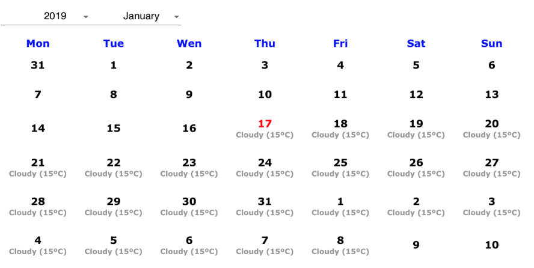

# exercise-calendar

## Installation

#### Basic Installation:

```
 git clone https://github.com/juanpe0504/exercise-calendar.git
 yarn install / npm install
 yarn start / npm start
```

#### For run tests:

```
 yarn test
```

## Calendar Exercise

#### User story
As Cotecna inspector I need a new calendar app that allows me to see the weather forecast for the next 5 days so that I’m able to plan my inspections accordingly.

The calendar should have two dropdowns to allow me to select a year and a month and it will display all the days of the selected month in a row-per-week view (just like the windows calendar).

Additionally, the calendar should be able to display the temperature and weather condition forecast for the next 5 days (only when the calendar is set to the current month).

#### Acceptance criteria
  -	User must be able to select a year and month using two dropdowns.

  - The calendar must display one row per week. Like the windows calendar.

  - The calendar must display the temperature and weather condition forecast (cloudy, sunny, snow, etc) for the next 5 days, but only if the calendar is set to the current month.

#### Technical requirements
  -	Use the forecast API from OpenWeatherMap.org (https://openweathermap.org/forecast5) to retrieve the temperature and weather condition data. You will have to sign up and obtain a free API key.

  - The exercise should be delivered as a GIT repo, hosted either on a public GitHub / GitLab / Bitbucket or zipped into a file. 

  - Full calendar components and date pickers are forbidden. The intent of the exercise is to implement the logic to display the calendar yourself. However, you are free to use libraries like moment.js (or similar) to make date manipulation easier.

  - Unit tests are not explicitly required, but we will appreciate them.

#### Mock Example


